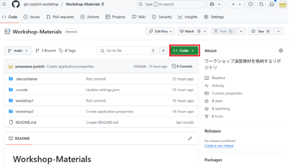

# workshop

## 事前準備（CodeSpaces）

GitHubにサインイン済みの場合は、2～4の作業は不要です。

1. ブラウザで`https://github.com/`にアクセス

2. `Sign in`をクリック

   

3. メールアドレスとパスワードを入力して、`Sign in`をクリック

   

4. 二要素認証のコードを入力して、`Verify`をクリック

   

5. `https://github.com/払出Organization名/github-workshop-basic`にアクセス
- 上記URLに含まれる払出Organization名は適宜変更してください。

上記URLのアクセスで、404エラーになる場合は、払出Organizationに参加できていないことが原因です。払出Organizationへの招待メールのJoin @払出Organization名のリンクをクリックして払出Organizationに参加した後、改めて上記URLのアクセスを試してください。

6. `<> Code`をクリック

   

7. `Codespaces`をクリック

   

8. `+`をクリック

   

9. 別タブでCodeSpacesのウィンドウが開く

   

10. 10分程度待機する（ウィンドウの右下に表示されるポップアップは無視してよい）

11. `java Ready`の表示の有無を確認する
   

java Readyの表示がある場合は、12～14の作業は不要です。

12. エクスプローラーを展開して、Worshop1のApp.javaを開く
   

13. `java Ready`の表示が出るまで待機する（2～3分程度）
   

14. `java Ready`の表示を確認する
   

15. CodeSpacesのウィンドウを`×`をクリックして閉じる
   

