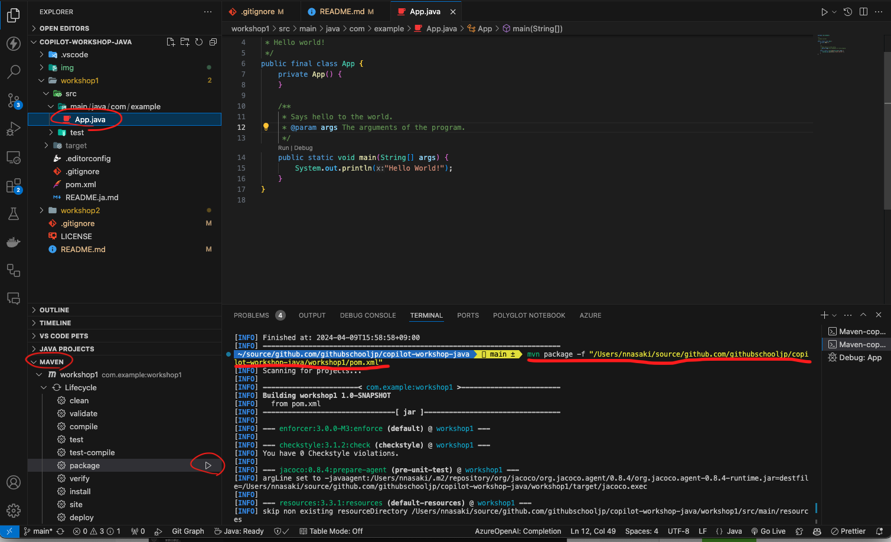
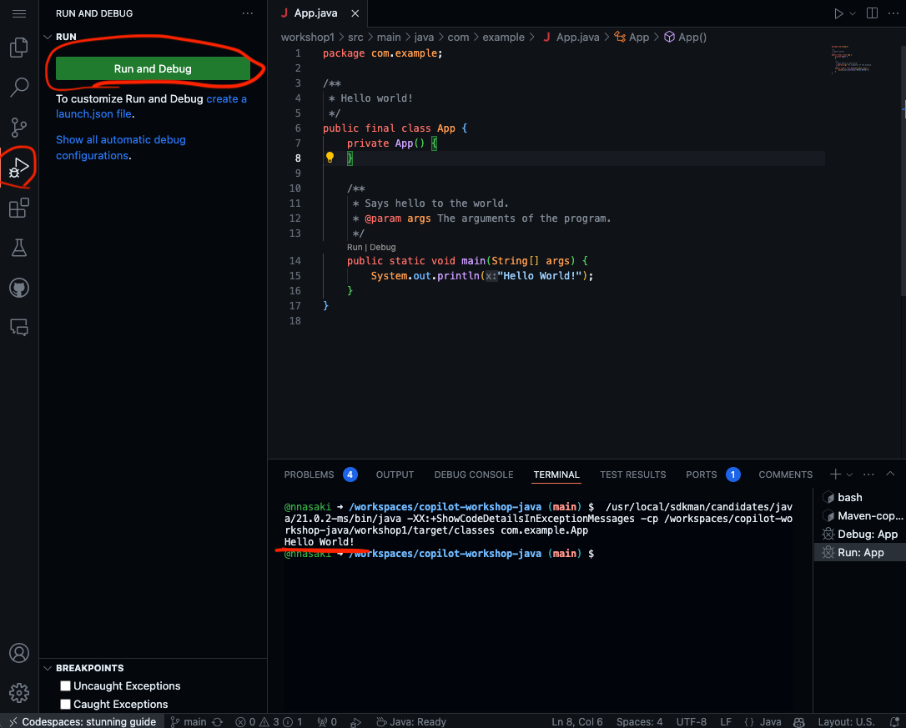
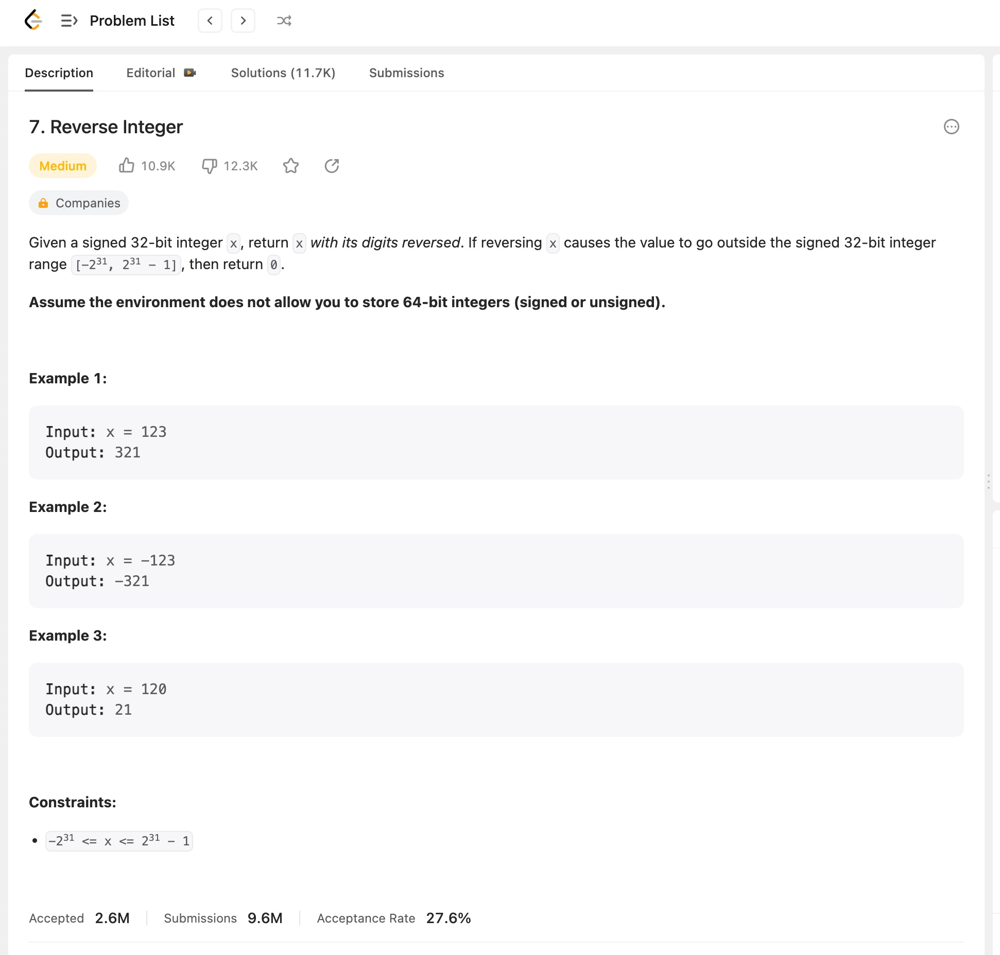
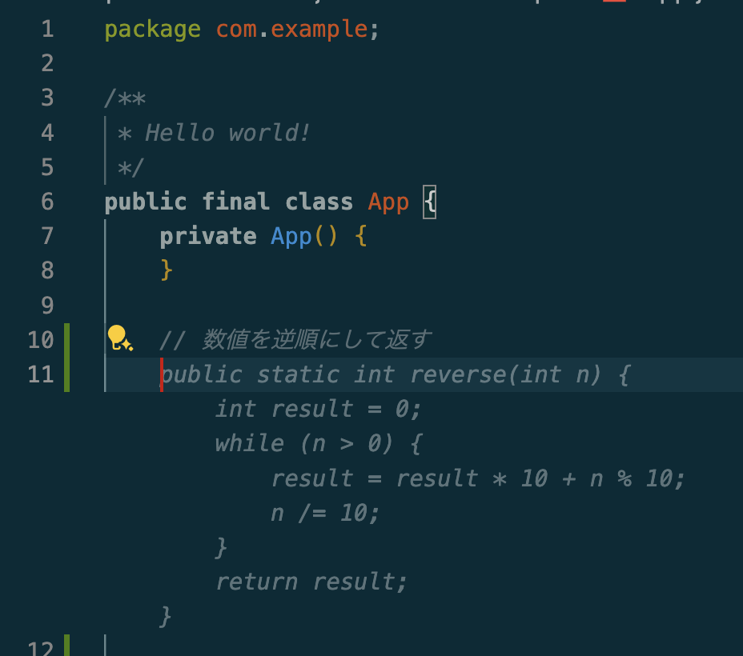
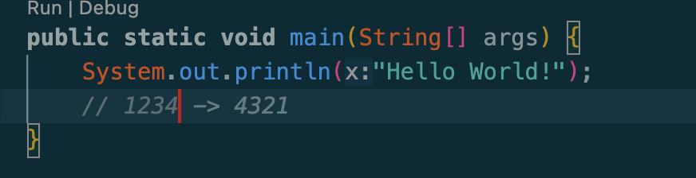
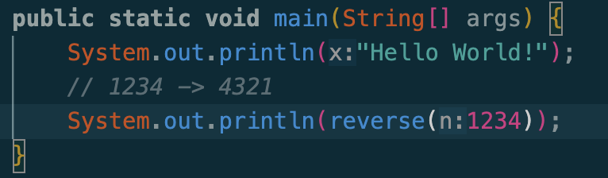
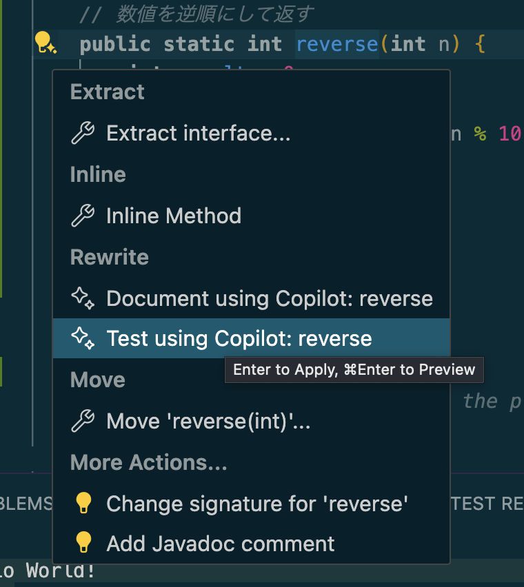
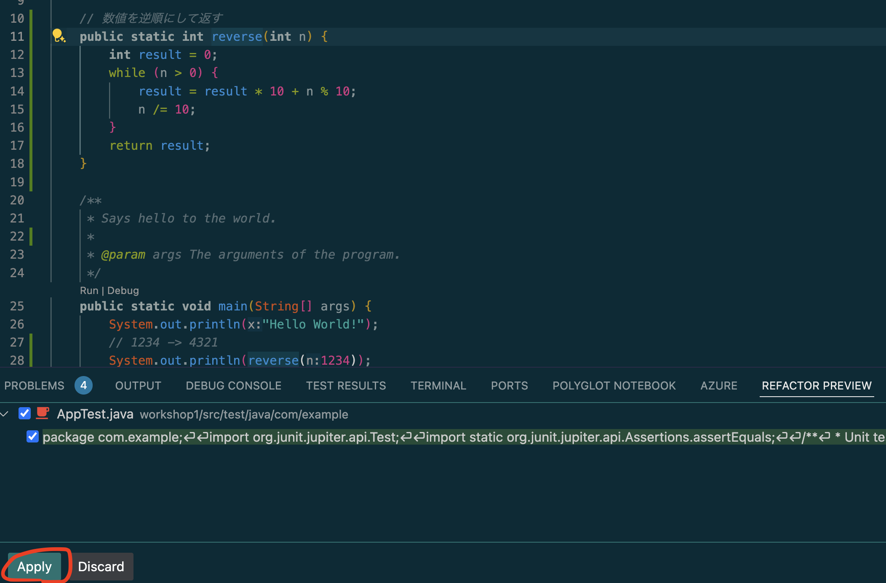
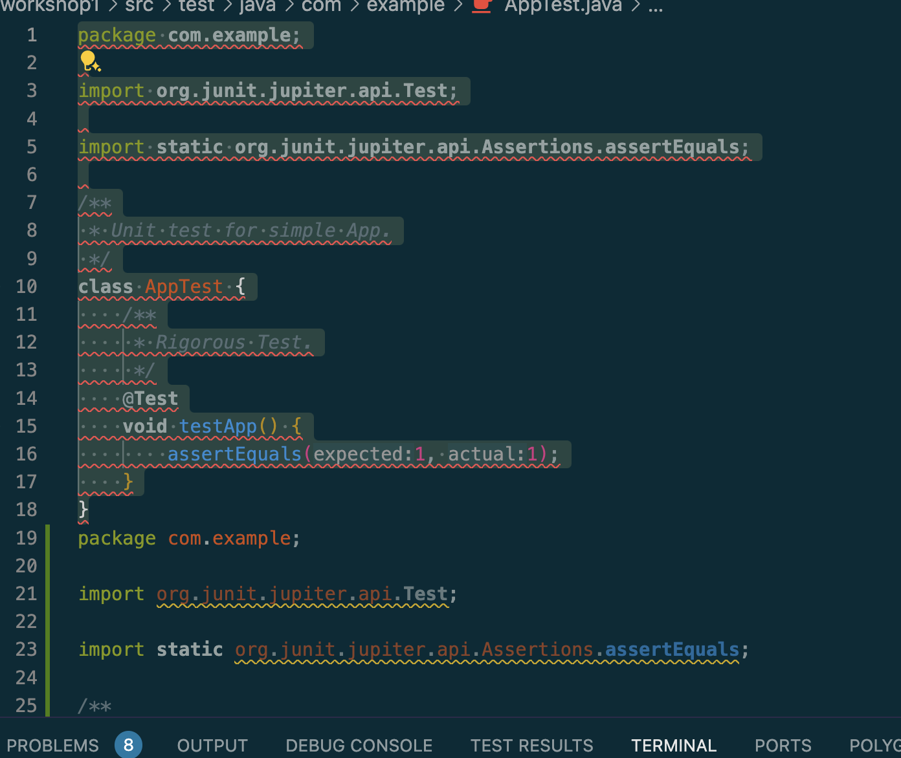
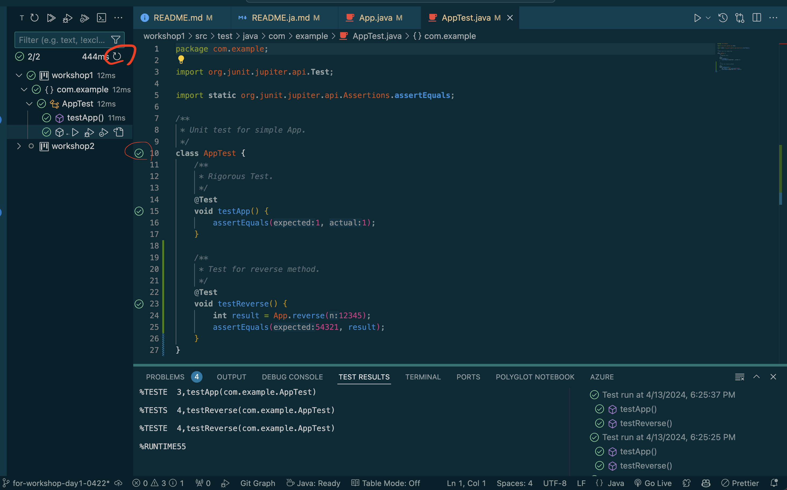

# 워크샵 1

## 초기 작동 확인
VSCode에서 `mvn package`를 실행합니다. 이는 아래와 같이 터미널 또는 GUI에서 수행할 수 있습니다.


정상적으로 완료되었는지 확인한 다음, 다음 화면을 실행하고 `Hello, World!`가 출력되는지 확인합니다.


이로써 초기 작동 확인이 완료되었습니다.

## 실습: 지정된 숫자를 뒤집는 함수 구현
이 연습에서는 GitHub Copilot를 사용하여 코드를 작성하는 방법을 배웁니다.

### 함수 추가
주어진 숫자를 역순으로 표시하는 함수를 단순히 추가합니다. 이것이 어떻게 보이는지에 대한 이미지입니다.


`App.java`에 `숫자를 뒤집다`라는 코멘트를 입력하고 키보드의 `return` 키를 누르면, GitHub Copilot가 코드를 제안합니다.


> [!NOTE]
> 코드가 제안되지 않으면 GitHub Copilot가 활성화되어 있는지 확인하십시오.
> IDE를 재시작해 보십시오.

키보드의 `tab` 키를 누르면 코드가 확인됩니다.

### 메인 함수에서 호출
메인 함수에 `// 1234`와 같은 것을 입력하면, 아래와 같은 제안을 받게 됩니다.


> [!NOTE]
> LLM의 특성상 결과는 항상 같지 않습니다. 환경에 따라 작동에 차이가 있을 수 있습니다.

`return`을 누르면 확인되고, `tab`을 다시 누르면 코드가 생성되므로 `return`으로 확인합니다.


실행하고 예상대로 작동하는지 확인합니다.

```
Hello World! 4321
```


같은 작업을 수행하여 값을 추가할 수 있습니다.

### 테스트 추가
추가된 함수를 클릭하고 왼쪽의 표시를 클릭합니다.


`Test using Copilot: reverse`를 클릭하고 화면 하단의 `Apply`를 클릭합니다.


`AppTest.java` 파일을 열고 원래 코드를 삭제합니다.

아래에 표시된 두 개의 빨간색 원 중 하나를 클릭하여 테스트를 실행할 수 있습니다. 오류가 발생하지 않는지 확인합니다.


같은 방식으로 테스트를 추가하고 확인해 봅시다.

### 사양 변경에 대응
이번에는 주어진 숫자를 단순히 뒤집어 반환하는 간단한 프로그램이지만, 다음과 같은 경우에는 어떻게 해야 할까요?
1. 0
2. 음수
3. Integer의 최대 양수 또는 음수 값
  1. Integer 범위 내에서 표현할 수 있나요?
  2. 오버플로우가 발생하나요?
4. 1000과 같은 연속된 0이 있는 숫자
  1. 0001이 맞나요? 아니면 그냥 1이어야 하나요?
간단한 프로그램이나 함수라도 다양한 입력 값이 있고 고려해야 할 많은 점이 있다는 것을 깨달았나요?
이 문제를 해결하기 위해 팀과 논의한 후 또는 상급자의 기분에 따라, 숫자로 반환하던 값을 문자열로 반환하도록 사양이 변경되었습니다.
제품 코드뿐만 아니라 테스트 코드도 추가되었습니다. 갑작스러운 사양 변경에도 자신감을 가지고 작업할 준비가 되어야 합니다. (맞나요?)
이러한 변경은 Copilot보다는 Copilot Chat에서 요청하는 것이 더 원활합니다.

```
다음 조건을 처리할 수 있는 문자열로 반환하도록 이 함수를 수정하십시오.

파라미터：0 결과：0
파라미터：-1 결과：-1
파라미터：-1234 결과：-4321
파라미터：Integer.MAX_VALUE(2147483647) 결과：7463847412
파라미터：Integer.MIN_VALUE(-2147483648) 결과：-8463847412
파라미터：1000 결과：0001
```