# Workshop 1 

## ハンズオン：指定した数字を逆順にする関数を実装しよう
本演習ではGitHub Copilotを利用してコーディングすることを学びます。
単純に与えられた数値を逆順に表示する関数を追加します。以下のようなイメージです。


### ソースコメントによる実装

#### 関数を追加

1.`App.java`に`数値を逆順にして返す`のようなコメントを入れて、キーボードの`Enter`を押下すると、GitHub Copilotがコードを提案してくれます。


2.キーボードの`tab`を入力するとコードが確定されます。

<div style="page-break-before:always"></div>

#### main関数から呼び出す
3.main関数の中に`// 1234`のように入れると以下のようなサジェストが出ます


4.`Enter`を入力すると確定し、また再度`tab`を入力するとコードが生成されますので`Enter`で確定します


5.実行し、以下のように期待する動作になるか確認しましょう。
```
Hello World!
4321
```
<div style="page-break-before:always"></div>

### インラインチャットによる実装

#### 関数を追加
1.`App.java`の9行目にカーソルを移動し、`ctrl＋ｉ`でインラインチャットを起動します。
チャット欄に`数値を逆順にして返す関数を作成してください`のようなプロンプトを入力して、キーボードの`Enter`を入力すると、GitHub Copilotがコードを提案してくれます。

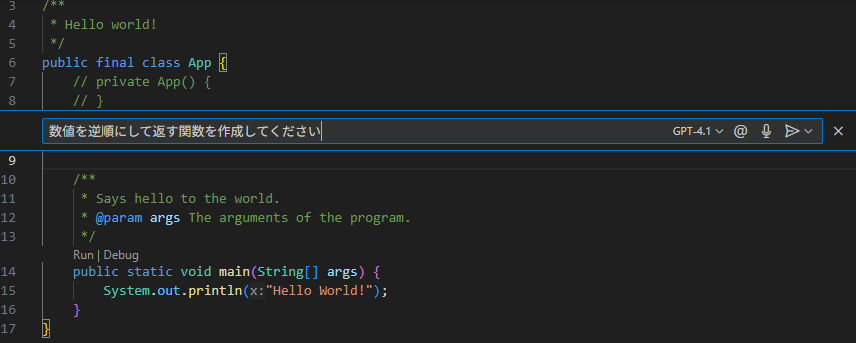

2.`同意する`をクリックするとコードが確定されます。

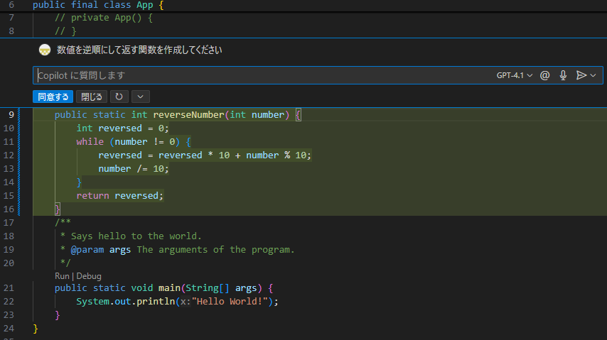

#### main関数から呼び出す
3.main関数にカーソルを移動し、`ctrl＋ｉ`でインラインチャットを起動します。
`reverse関数を呼び出す処理を作成してください`のようなプロンプトを入力して、キーボードの`Enter`を入力すると、GitHub Copilotがコードを提案してくれます。

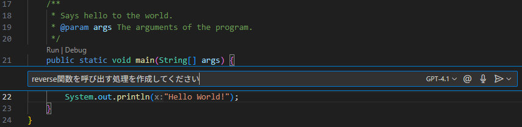

4.`同意する`をクリックするとコードが確定されます。

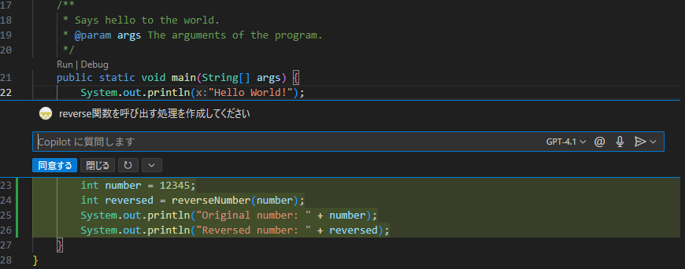

5.実行し、以下のように期待する動作になるか確認しましょう。
```
Hello World!
54321
```

<div style="page-break-before:always"></div>

## ハンズオン：関数のテストを実装しよう

#### テストコードの生成

1．追加した関数名にカーソルを移動し、左のアイコンをクリックしてください。
表示されたメニューの`Copilot を使用してテストを生成する` をクリックしてください。

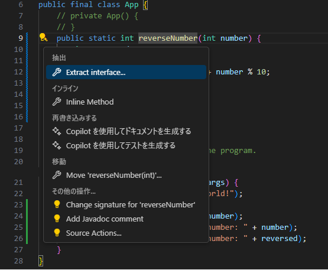

<div style="page-break-before:always"></div>

2．AppTest.javaが自動で開き、GitHub Copilotがテストコードを提案してくれます。
`同意する`をクリックしてコードを確定し、ctrl＋sで保存します。

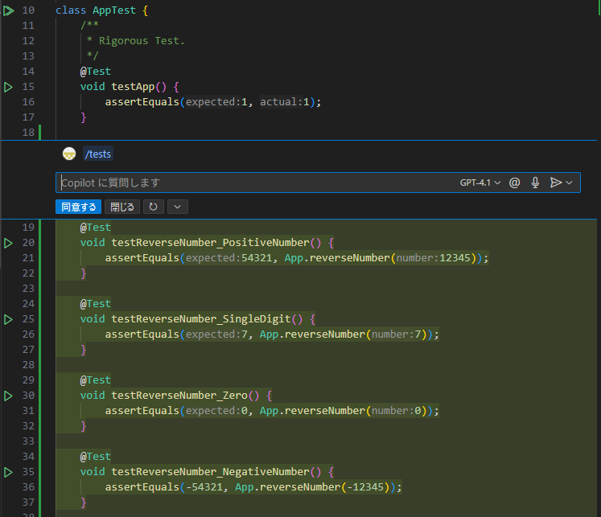

<div style="page-break-before:always"></div>

#### テストの実行

3．コードの行数の左側に表示されている三角形のアイコンをクリックして、テストを実行します。

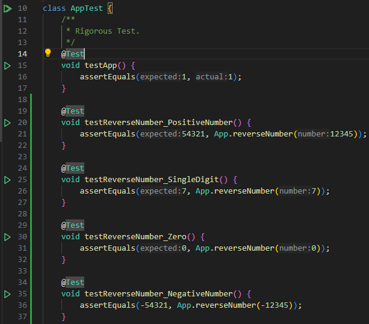

<div style="page-break-before:always"></div>

4．ターミナルのテスト結果タブにテスト結果が出力されます。
画面右下のTest Runner for Javaとテストコードの左側のアイコンで、テスト結果を確認できます。
どちらも、緑のチェックアイコンになっていることを確認してください。
全て緑のチェックアイコンで表示されていれば、テストが正常終了しています。

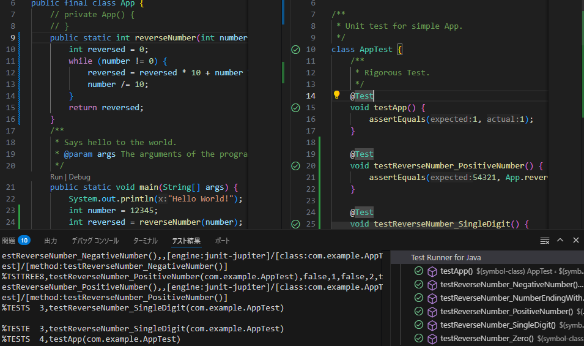

<div style="page-break-before:always"></div>

## ハンズオン：関数の仕様変更をしよう

#### 概要
今回はただ与えられた数字を逆順にして返すという単純なプログラムですが、次のケースの場合はどのように振る舞えば良いでしょうか？
1. 0
2. -(マイナス)
3. Integerの正の最大値、または、負の最大値
   1. Integerの範囲で表現できるか？
   2. オーバーフローは起きないか？
4. 1000のような0が連続した数値
   1. 0001が正しいのでしょうか？1のみで良いのでしょうか？

簡単なプログラム、関数に見えますが様々な入力値が存在し、考慮すべき点が多いことに気づかれましたか？
この問題に対応するため、チームで話し合った結果、もしくは偉い人の鶴の一声で、今まで数値で返却していた値を文字列として返却することに仕様変更されました。

これまでにプロダクトコードの他にテストコードも追加されました。皆さんは急な仕様変更に対しても自信を持って作業する準備はできているはずです。（そうですよね？）

チャット機能を使って、仕様変更を行います。

<div style="page-break-before:always"></div>

#### 仕様変更

1．AppTest.javaは閉じてください。App.javaのみを開いてください。
画面上部のGitHubアイコンをクリックして、チャットの画面を表示してください。

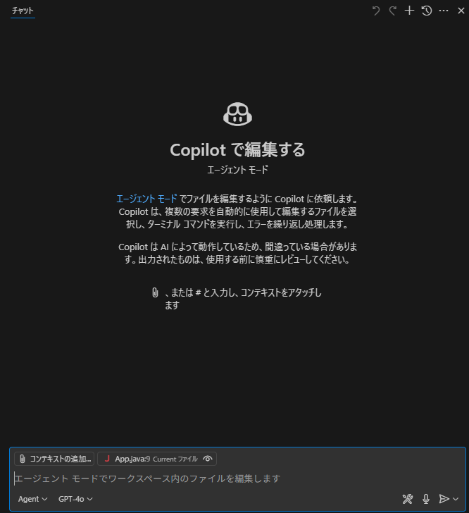

<div style="page-break-before:always"></div>

2．画面下部の設定を確認し、Chatの動作モードを`Ask`、使用するモデルは`GPT-4o`にしてください。

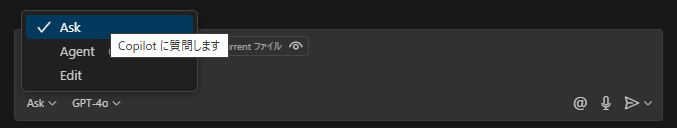

3．App.javaを開いた状態で、以下の内容をチャット欄に入力して、キーボードのEnterを入力してください。

```
この関数を以下の条件に対応できるように文字列で返却するように変更してください。
1. パラメーター：0　結果：0
2. パラメーター：-1　結果：-1
3. パラメーター：-1234　結果：-4321
4. パラメーター：Integer.MAX_VALUE(2147483647)　結果：7463847412
5. パラメーター：Integer.MIN_VALUE(-2147483648)　結果：-8463847412
6. パラメーター：1000 結果：0001
```
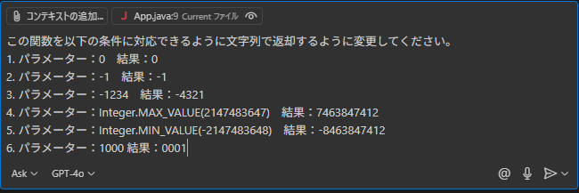

<div style="page-break-before:always"></div>

4．GitHub Copilotが提案したコードを適用するアイコンをクリックして適用します。

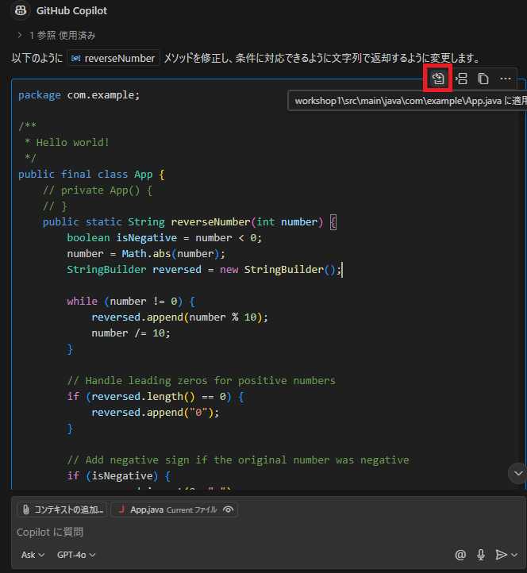

<div style="page-break-before:always"></div>

5．保持をクリックしてコードを確定し、実行します。

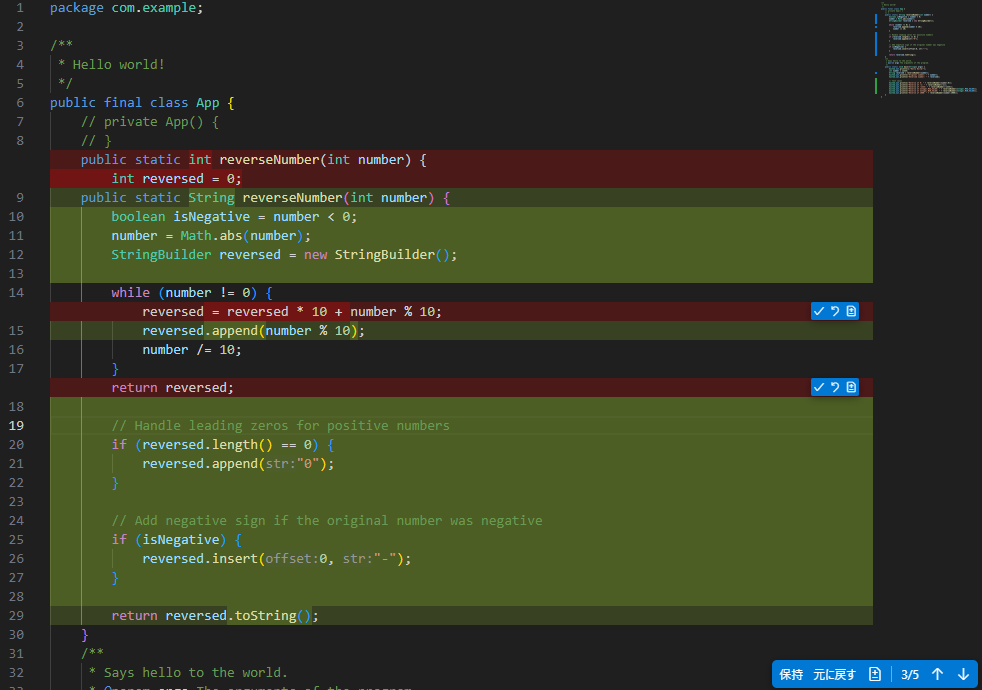

6．ターミナルで実行結果を確認します。仕様通りの結果にならなかった場合は、チャットでGitHub Copilotに修正依頼をしてください。

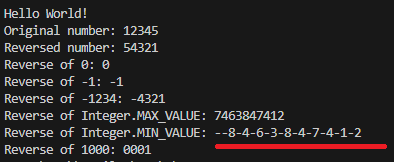

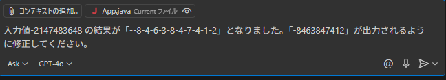
