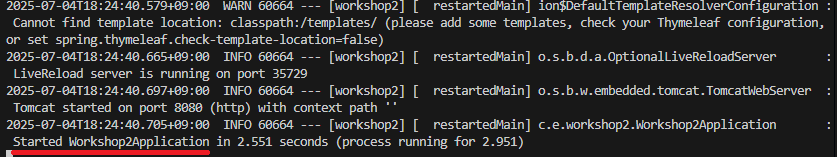
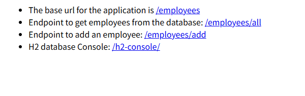

# Workshop 2 
本ワークショップではGitHub Copilotを利用して、従業員情報を管理するWebアプリケーションを作成します。

## 事前準備

### アプリケーションの実行

1.ターミナルを開き、cdコマンドでWorkshop2のディレクトリに移動してください。

例：Workshop1がカレントディレクトリの場合のコマンド
```
cd ..
cd workshop2
```

2.`mvn clean spring-boot:run` を入力してEnterキーを押下してください。

ログに`Started Workshop2Application`が出力されて入れば、正常にアプリケーションが実行できています。



3.ブラウザでアプリケーションにアクセスしてください。

- Visual Studio Code
  - http://localhost:8080/
- CodeSpaces
  - https://<ホスト名>-8080.app.github.dev/
    - 受講者ごとにホスト名は異なりますので、ご自身のホスト名を確認してアクセスしてください。

4.以下のテキストとリンクが表示される画面が表示されれば正常にアプリケーションが起動しています。



### データベースの設定

H2データベースの設定を行います。

#### application.properties

1.エクスプローラーで`src/main/resources` を選択し、`application.properties` ファイルを開きます。

2.以下の内容を追加します。

```properties
spring.datasource.url=jdbc:h2:./data/test
spring.datasource.driverClassName=org.h2.Driver
spring.datasource.username=sa
spring.datasource.password=password
spring.jpa.hibernate.ddl-auto=update
spring.jpa.database-platform=org.hibernate.dialect.H2Dialect
```

<div style="page-break-before:always"></div>

## ハンズオン：従業員情報を取得する機能を実装しよう

### 機能要件
- `<ホスト名>/employees/all`でデータベースから従業員情報を取得する
  - ベースパスは`employees/`で`/all`が従業員情報を取得する機能とする
- 従業員情報のカラムは以下
  - ID（自動採番）
  - 名前
  - メールアドレス
  - 所属部署
  - 電話番号

### 動作確認
- `<ホスト名>/employees/all`にブラウザでアクセスして、データベースから従業員情報を取得できること

### ポイント
- 1回目のプロンプトで従業員情報を取得する処理を作る
- 2回目のプロンプトでカラムを修正する
- 3回目以降のプロンプトでデータベースに従業員情報を登録する
- GitHub Copilotに参照させたいファイルを開いておく（もしくは、コンテキストに追加）
  - 1回目のプロンプトでは、application.properties、Workshop2Application.java
  - 2回目のプロンプトでは、カラムを定義しているJavaファイル（例：Employee.java）
- application.propertiesのコード提案があった場合は、適用しないこと
  - MySQLなど別のデータベースの設定を提案する可能性があるが、設定済みの環境（H2データベース）を使うので適用しない
- エラーが発生した場合は、エラーコードをChat欄に貼り付けてGitHub Copilotに聞く

### 制約
- 要件のみをプロンプトに書く（プロンプトにコードの書き方に関する内容は含めない）
  - 期待したコードが提案されない場合は、含めても良い
    - Controller、Entity、Repositoryを作るように促すなど
- 1点例外でカラムを修正するときに以下の内容をプロンプトに含める
  - `Employeeテーブルのカラム名は@Columnを使ってマッピングしてください。`
    - ソースコードのカラム名とデータベースのカラム名を同じにするため

<div style="page-break-before:always"></div>

### プロンプト入力例

- 1回目のプロンプト
  - 参照ファイル：application.properties、Workshop2Application.java
  - プロンプト：`/employees/all`でデータベースから従業員情報を取得する処理を作ってください。
  ベースパスは/employeesで/allが従業員情報を登録する処理にしてください。

- 2回目のプロンプト
  - 参照ファイル：Employee.java
  - >Employeeテーブルのカラムは、ID（自動採番）、名前、メールアドレス、所属部署、電話番号にしてください。
  Employeeテーブルのカラム名は@Columnでマッピングしてください。

- 3回目のプロンプト
  - 参照ファイル：application.properties、Employee.java
  - プロンプト：データベースにSQLコマンドで従業員情報を登録する方法を教えてください。
    - 精度が悪い場合は情報を付与（H2データベース、Employeeテーブルなど）する
- 4回目のプロンプト（1回目のプロンプトでSQL文の回答があった場合は不要）
  - 参照ファイル：application.properties、Employee.java
  - プロンプト：Employeeテーブルに従業員情報を登録するSQLコマンドを作ってください。

<div style="page-break-before:always"></div>

## ハンズオン：従業員情報を登録する機能を実装しよう

### 要件
- `<ホスト名>/employees/add`でデータベースに従業員情報を登録する
  - ベースパスは`employees/`で`/add`が従業員情報を登録する機能とする

### 動作確認
- `<ホスト名>/employees/add`でPOST送信で従業員情報を登録できること
- `<ホスト名>/employees/all`にブラウザでアクセスして、登録した従業員情報が表示されること

### ポイント
- 1回のプロンプトで登録する機能を作る
- GitHub Copilotに参照させたいファイルを開いておく（もしくは、コンテキストに追加）
  - 参照させたいファイルが分からない場合は、GitHub Copilotに聞く 
- 動作確認がブラウザで実施できないので、ターミナルで従業員情報を登録する
  - PowershellもしくはLinux系のターミナル（Git Bash）でcurlを使う
  - コマンドの投げ方はGitHub Copilotに聞く
  - コマンドに日本語が含まれていると文字化けやエラーが発生するので、日本語が含まれないコマンドを作ること

### 制約
- 要件のみをプロンプトに入力して作る
  - プロンプトにコードの書き方に関する内容は含めない
    - プロンプトを工夫しても中々期待したコードが提案されない場合は、含めても良い

### チャレンジ
- 従業員情報を削除する機能を作成する
  - パスの指定はしないので自由に作る
- ソースコードを簡潔にする
  - Lombokを使うように修正するなど

<div style="page-break-before:always"></div>

### プロンプト入力例
- 機能作成
  - 1回目のプロンプト
    - 参照ファイル：EmployeeController.java
    - プロンプト：/employees/addでデータベースから従業員情報を登録する処理を作ってください。
ベースパスは/employeesで/addが従業員情報を登録する処理にしてください。
  - 2回目のプロンプト
    - 参照ファイル：Employee.java
    - プロンプト：
      - curlで従業員情報を登録するコマンドを作ってください。
      - powershellで従業員情報を登録するコマンドを作ってください。

- チャレンジ
  - 1回目のプロンプト
    - 参照ファイル：EmployeeController.java
    - プロンプト：データベースから従業員情報を削除する処理を作ってください。
  - 2回目のプロンプト（1回目のプロンプトでSQL文の回答があった場合は不要）
    - 参照ファイル：application.properties、Employee.java
    - プロンプト：Employeeテーブルから従業員情報を削除するSQLコマンドを作ってください。

<div style="page-break-before:always"></div>

## ハンズオン：従業員情報を登録するフォームを作成しよう

### 要件
- ブラウザで従業員情報を登録できる

### 動作確認
- ブラウザで従業員情報を登録できること
- `<ホスト名>/employees/all`にアクセスして、登録した従業員情報が表示されること

### ポイント
- 特になし

### チャレンジ
- 画面をデザインする
